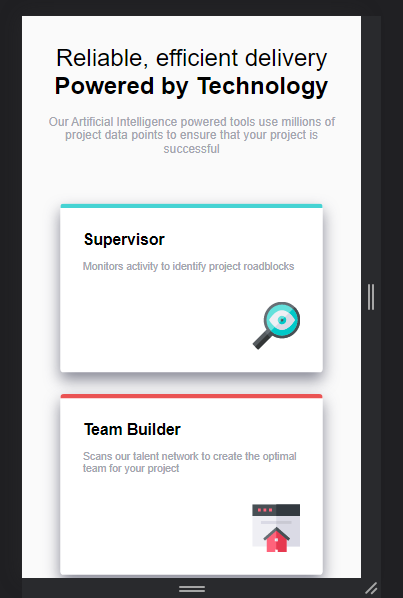
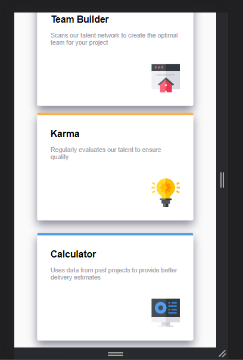
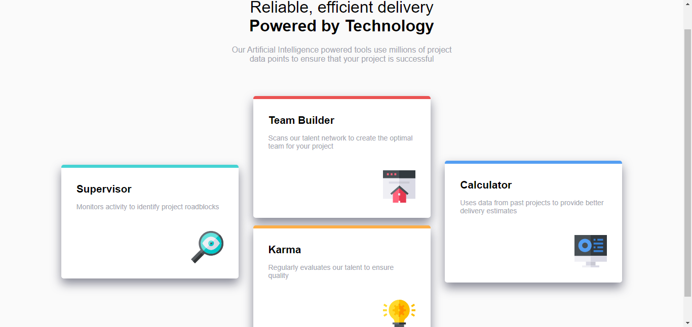

## Table of contents

- [Overview](#overview)
  - [The challenge](#the-challenge)
  - [Screenshot](#screenshot)
  - [Links](#links)
- [My process](#my-process)
  - [Built with](#built-with)
  - [What I learned](#what-i-learned)
  - [Continued development](#continued-development)
  - [Useful resources](#useful-resources)
- [Author](#author)

## Overview
This is a solution to the [Four card feature section challenge on Frontend Mentor](https://www.frontendmentor.io/challenges/four-card-feature-section-weK1eFYK).
### The challenge

Users should be able to:

- View the optimal layout for the site depending on their device's screen size

### Screenshot






### Links

- Solution URL: [Add solution URL here](https://www.frontendmentor.io/challenges/four-card-feature-section-weK1eFYK/hub)
- Live Site URL: [Add live site URL here](https://iceberg61.github.io/four-card-feature-section-master/)

## My process

### Built with

- Semantic HTML5 markup
- CSS custom properties
- Flexbox


### What I learned

I was shocked on how this layout was possible with just two box inside a div and using flex-wrap to wrap them.
While i was suprised because i was thinking off achiving this layout with grid layout.

```html
<div>
      <div class="box box-red">
        <h2>Team Builder</h2>
        <p>Scans our talent network to create the optimal team for your project</p>
        
      </div>
  
      <div class="box box-orange">
        <h2>Karma</h2>
        <p>Regularly evaluates our talent to ensure quality</p>
        
      </div>
    </div>
```
```css
.card-container {
    display: flex;
    flex-wrap: wrap;
    justify-content: center;
    margin: 0 auto;
    max-width: 71.25rem;
    align-items: center;
}
```


### Useful resources

- [Example resource 1](https://codesandbox.io/s/5g904) - this website made me know the power of flex-wrap


## Author
- Frontend Mentor - [@iceberg61](https://www.frontendmentor.io/profile/iceberg61)
- Twitter - [@ayanakoji-kiyo](https://www.twitter.com/ayanakoji-kiyo)
